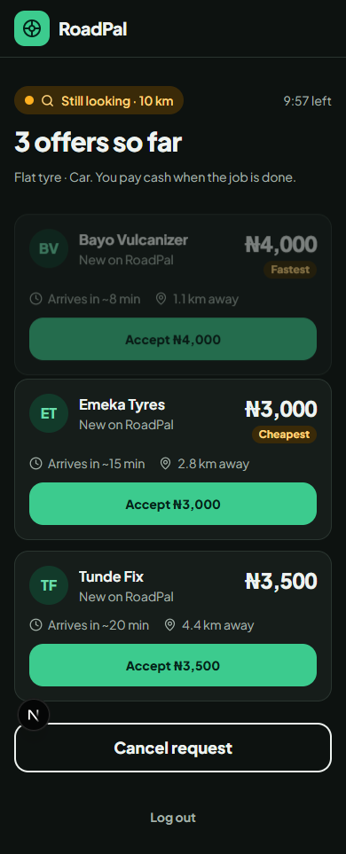
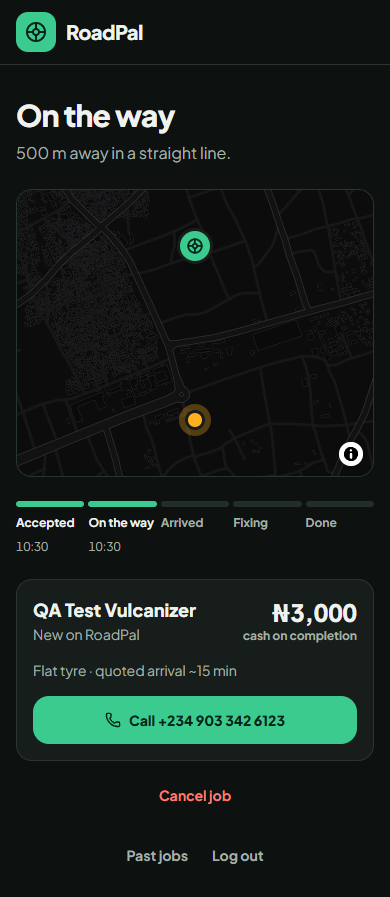
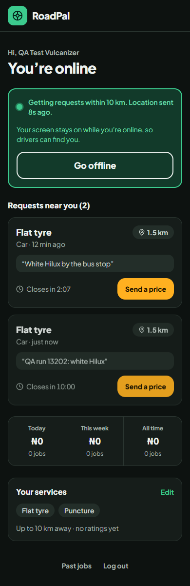

# RoadPal

**Tyre help on the road, on demand.** A driver with a flat tyre sends a request; nearby vulcanizers
reply with a price and an arrival time; the driver picks one and watches them come on a live map.
Built for Nigeria: prices in naira, cash on completion, phone-number login.

**Live:** [roadpal.iykekelvins.dev](https://roadpal.iykekelvins.dev). Installable as an app (PWA)
on Android and iOS.

> Demo mode: login codes are shown on screen instead of sent by SMS, so you can try both sides with
> any number. Open it in two browsers (or one normal + one private window), sign in once as a
> **driver** and once as a **vulcanizer**, and run a job end to end. The free server sleeps when
> idle, so the first request after a quiet spell takes about a minute.

| Driver: compare offers                                               | Driver: live tracking                                                           | Vulcanizer: requests nearby                                                            |
| -------------------------------------------------------------------- | ------------------------------------------------------------------------------- | -------------------------------------------------------------------------------------- |
|  |  |  |

## What it does

**Drivers**

- Share their location, pick the vehicle and the problem (flat, puncture, burst, no spare…), add a note.
- Get offers from vulcanizers nearby, each with a price, arrival estimate and distance; the search
  widens automatically if nobody answers.
- Accept one, then follow them on a live map through _on the way → arrived → fixing → done_.
- Pay cash, rate the job, and see past jobs.

**Vulcanizers**

- Set up a workshop profile and the services they offer, then go online.
- See requests within their radius appear instantly and send a price with one tap.
- Run the job with live location sharing (the screen stays awake while online), and track earnings
  for today, this week and all time.

## How it's built

A pnpm + Turborepo monorepo:

|                   |                                                                                        |
| ----------------- | -------------------------------------------------------------------------------------- |
| `apps/web`        | Next.js 16 (App Router), React 19, Tailwind CSS v4, MapLibre GL with OpenFreeMap tiles |
| `apps/api`        | NestJS 12, Socket.IO, Drizzle ORM                                                      |
| `packages/shared` | Zod schemas and types shared by both apps                                              |
| Database          | Postgres with PostGIS on Neon                                                          |

Some details worth a look:

- **Realtime both ways.** Requests, offers, job status and the vulcanizer's position travel over
  Socket.IO. Location updates are sent as volatile messages (a stale position is worth nothing), and
  every reconnect refetches state over REST, so a dropped connection never leaves a screen out of date.
- **Geo matching in the database.** PostGIS finds online vulcanizers within each request's radius;
  background sweeps expire old requests, widen the radius and mark silent vulcanizers offline.
- **Race-safe state changes.** Accepting an offer, cancelling and updating a job are single
  conditional updates, so two people tapping at the same moment can't both win. Integration tests
  cover the races.
- **Phone login without passwords.** One-time codes with a 30-day sliding session (short-lived
  access token in memory, refresh token in an httpOnly cookie). Code sending is rate-limited per
  number, per IP and per day, which also caps the SMS bill.
- **Runs at zero cost.** Vercel (web), Render free tier (API) and Neon free tier (database). The API
  pauses its background sweeps when nobody is using the app so the database can sleep too, and the
  web app shows a "waking up the server" notice while Render cold-starts.

## Running it locally

Needs Node 24 and a [Neon](https://neon.tech) Postgres database (free; PostGIS is enabled by the
migrations).

```bash
corepack pnpm install
cp apps/api/.env.example apps/api/.env   # then fill in DATABASE_URL, DATABASE_URL_DIRECT, JWT_ACCESS_SECRET
corepack pnpm --filter @repo/api db:migrate
corepack pnpm dev
```

- Web: http://localhost:3001 · API: http://localhost:8000
- `corepack pnpm simulate` starts a fake vulcanizer near you that sends offers, so you can test the
  driver side alone.
- Tests: `corepack pnpm test` (unit) and `corepack pnpm --filter @repo/api test:e2e` (integration;
  needs `TEST_DATABASE_URL` pointing at a separate database branch).

## Deploying

- **API:** `render.yaml` is a Render Blueprint; create a Blueprint from the repo and paste in the
  secrets it asks for. Migrations run as part of the build.
- **Web:** import `apps/web` into Vercel (settings live in `apps/web/vercel.json`) and set `API_URL`
  and `NEXT_PUBLIC_SOCKET_URL` to the API's URL.
- **Real SMS:** set `SMS_MODE=termii` plus the `TERMII_*` keys on the API. Until then it runs in demo mode.
